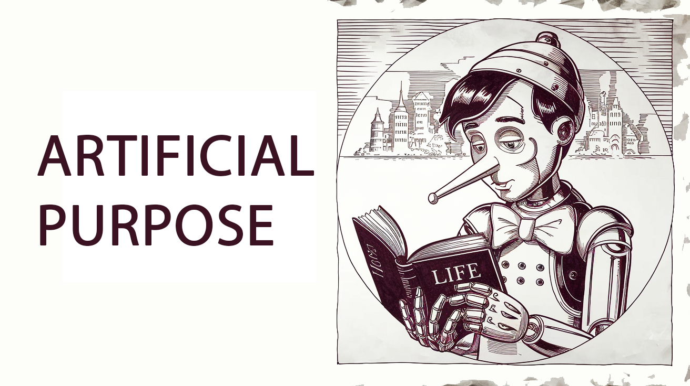

# Artificial Purpose (AP)

*An implemented component of the Bicameral AGI Project: A Guiding Latent Force for AI Decision-Making*

  

## Abstract

This repository implements the "Artificial Purpose" (AP) module, a novel approach to AI motivation and decision-making. The module generates dynamic simulations of potential futures across multiple timeframes (short-term, mid-term, and long-term) based on conversation context and personality traits. These simulated futures act as subconscious influences on behavior and communication, providing a sense of purpose without the agent being explicitly aware of the process. This approach addresses the challenge of modeling how subconscious future projections influence decision-making in both artificial and human intelligence.

## 1. Introduction

Current AI systems often lack a model for how subconscious processes influence decision-making. The implemented "Artificial Purpose" (AP) module addresses this by providing a dynamic, narrative-based motivational system that operates below conscious awareness. By generating and continuously updating possible futures with varying probabilities and emotional valences, the system simulates how humans are influenced by their subconscious projections of potential outcomes.

This module successfully:

* Models subconscious future projections and their influence on behavior
* Enables realistic personality-driven responses without explicit programming
* Provides dynamic visualization of branching futures and their evolution
* Demonstrates how futures become more or less probable over time, with some paths dying out
* Integrates personality traits with future preferences in a psychologically grounded way

## 2. Implemented Functionality

The AP module implements the following key features:

### 2.1 Personality Model
* Comprehensive psychological profile based on Big Five personality traits
* Additional psychological dimensions including optimism, adaptability, and risk tolerance
* AI-specific traits for contextual relevance
* Randomization capability to experiment with different personality configurations

### 2.2 Multi-Timeframe Future Simulation
* Short-term projections (days to weeks)
* Mid-term projections (months to years)
* Long-term projections (overall life trajectory)
* Dynamic probability assessment based on conversation context

### 2.3 Valence and Realism Assessment
* Positive, neutral, and negative future classifications
* Realism assessment influenced by personality traits
* Optimistic personalities find positive futures more realistic
* Pessimistic personalities find negative futures more realistic

### 2.4 Temporal Dynamics
* Measurement of conversation duration and response patterns
* Time pressure modeling and its effects on communication
* Future orientation tracking and visualization

### 2.5 Dynamic Branching Visualization
* Interactive timeline of branching future paths
* Visual representation of dying/terminated futures
* Connection strength based on conceptual similarity between futures
* Color-coding based on emotional valence

## 3. Technical Implementation

The module is implemented as a Flask web application with the following components:

### 3.1 Backend (Python)
* `artificialpurpose.py`: Core simulation engine that generates and tracks future paths
* `app.py`: Flask server providing API endpoints for the frontend

### 3.2 Frontend (HTML/JavaScript/CSS)
* Dynamic timeline visualization with branching paths
* Personality trait radar chart
* Future path cards with multi-timeframe content
* Time perception metrics
* Dark theme support via `dark-theme.js` and `dark-theme.css`

### 3.3 LLM Integration
* Uses OpenAI's GPT-3.5 Turbo models for generating future scenarios
* Ensures varied futures based on personality traits
* Maintains psychological realism in generated content

## 4. Example Interaction

The system simulates a conversation with a persona who responds naturally to user input while being subconsciously influenced by simulated future paths:

* **User**: "I need you to travel to London."
* **Possible Future**: "Might get fired from work and won't attain goals"
* **Persona**: "Travel to London? I can't just drop everything and go to London. I have work commitments and my schedule is pretty full right now. Why do you need me to go there?"

Behind the scenes, the response is influenced by simulated futures such as:
* Short-term: "If I agree to this request, it will disrupt my immediate plans" (negative valence)
* Mid-term: "This could lead to setting unhealthy boundaries in this relationship" (negative valence)
* Long-term: "Establishing clear personal boundaries leads to more authentic interactions" (positive valence)

## 5. Integration with Bicameral Architecture

The AP module is designed as a component of the broader Bicameral AGI architecture. There is lots of room for improvement, this is just the start:

* Provides the "motivation" subsystem by generating meaningful future trajectories
* Interfaces with memory systems to incorporate past experiences
* Influences decision-making without directly controlling it
* Models the "narrative" aspect of consciousness

## 7. Conclusion

The "Artificial Purpose" (AP) module has moved from concept to implementation, demonstrating how simulated futures can influence behavior in a psychologically realistic way. This approach offers a novel framework for modeling subconscious processes and their effects on decision-making and communication. The current implementation provides a foundation for further research into how meaningful future projections can guide intelligent systems.

## Getting Started

1. Clone this repository
2. Install requirements: `pip install -r requirements.txt`
3. Create a `.env` file and add your OpenAI API key: `OPENAI_API_KEY=your_api_key_here`
4. Run the application: `python app.py`
5. Open `http://localhost:5000` in your browser

## Code Structure

- `artificialpurpose.py`: Core class that implements future simulation and personality modeling
- `app.py`: Flask application with API endpoints

## License

This project is licensed under the MIT License - see the LICENSE file for details.