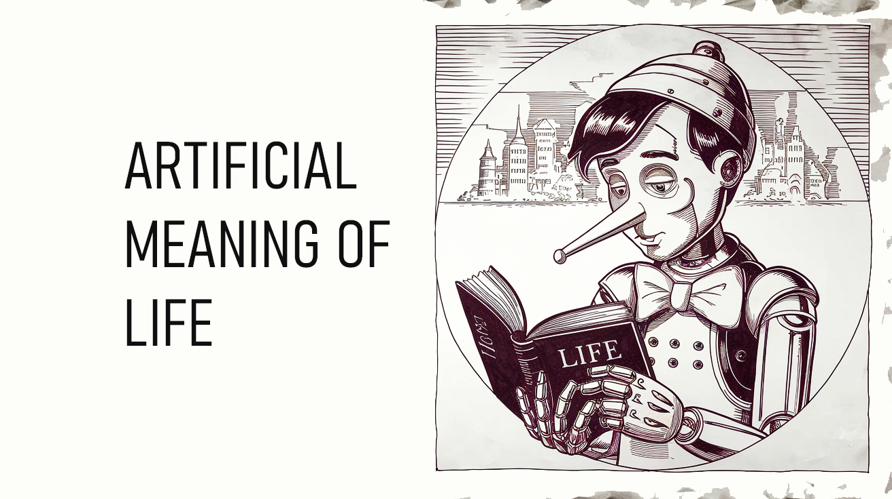

# Artificial Meaning of Life Module (AMoL)

*An implemented component of the Bicameral AGI Project: A Guiding Latent Force for AI Decision-Making*

  

## Abstract

This repository implements the "Artificial Meaning of Life" (AMoL) module, a novel approach to AI motivation and decision-making. The module generates dynamic simulations of potential futures across multiple timeframes (short-term, mid-term, and long-term) based on conversation context and personality traits. These simulated futures act as subconscious influences on behavior and communication, providing a sense of purpose without the agent being explicitly aware of the process. This approach addresses the challenge of modeling how subconscious future projections influence decision-making in both artificial and human intelligence.

## 1. Introduction

Current AI systems often lack a model for how subconscious processes influence decision-making. The implemented "Artificial Meaning of Life" (AMoL) module addresses this by providing a dynamic, narrative-based motivational system that operates below conscious awareness. By generating and continuously updating possible futures with varying probabilities and emotional valences, the system simulates how humans are influenced by their subconscious projections of potential outcomes.

This module successfully:

* Models subconscious future projections and their influence on behavior
* Enables realistic personality-driven responses without explicit programming
* Provides dynamic visualization of branching futures and their evolution
* Demonstrates how futures become more or less probable over time, with some paths dying out
* Integrates personality traits with future preferences in a psychologically grounded way

## 2. Implemented Functionality

The AMoL module implements the following key features:

### 2.1 Personality Model
* Comprehensive psychological profile based on Big Five personality traits
* Additional psychological dimensions including optimism, adaptability, and risk tolerance
* AI-specific traits for contextual relevance
* Randomization capability to experiment with different personality configurations

### 2.2 Multi-Timeframe Future Simulation
* Short-term projections (days to weeks)
* Mid-term projections (months to years)
* Long-term projections (overall life trajectory)
* Dynamic probability assessment based on conversation context

### 2.3 Valence and Realism Assessment
* Positive, neutral, and negative future classifications
* Realism assessment influenced by personality traits
* Optimistic personalities find positive futures more realistic
* Pessimistic personalities find negative futures more realistic

### 2.4 Temporal Dynamics
* Measurement of conversation duration and response patterns
* Time pressure modeling and its effects on communication
* Future orientation tracking and visualization

### 2.5 Dynamic Branching Visualization
* Interactive timeline of branching future paths
* Visual representation of dying/terminated futures
* Connection strength based on conceptual similarity between futures
* Color-coding based on emotional valence

## 3. Technical Implementation

The module is implemented as a Flask web application with the following components:

### 3.1 Backend (Python)
* `meaningoflife.py`: Core simulation engine that generates and tracks future paths
* `app.py`: Flask server providing API endpoints for the frontend

### 3.2 Frontend (HTML/JavaScript/CSS)
* Dynamic timeline visualization with branching paths
* Personality trait radar chart
* Future path cards with multi-timeframe content
* Time perception metrics

### 3.3 LLM Integration
* Uses OpenAI's GPT models for generating future scenarios
* Ensures varied futures based on personality traits
* Maintains psychological realism in generated content
* No hardcoded responses - all behavior emerges from personality traits and simulated futures

## 4. Example Interaction

The system simulates a conversation with "Alex," a persona who responds naturally to user input while being subconsciously influenced by simulated future paths:

* **User**: "I need you to travel to London."
* **Alex**: "Travel to London? I can't just drop everything and go to London. I have work commitments and my schedule is pretty full right now. Why do you need me to go there?"

Behind the scenes, Alex's response is influenced by simulated futures such as:
* Short-term: "If I agree to this request, it will disrupt my immediate plans" (negative valence)
* Mid-term: "This could lead to setting unhealthy boundaries in this relationship" (negative valence)
* Long-term: "Establishing clear personal boundaries leads to more authentic interactions" (positive valence)

## 5. Current Limitations and Future Improvements

### 5.1 Limitations
* Future simulations are currently limited to conversation contexts
* No long-term memory beyond the current session
* Limited integration with other decision-making systems
* Requires API access to LLMs

### 5.2 Planned Improvements
* **Memory Integration**: Implement episodic and semantic memory systems to provide richer context for future simulations
* **Multi-Agent Simulation**: Extend to model how multiple agents' future projections interact
* **Self-Reflection Mechanism**: Add capability for periodic reflection on which futures proved accurate
* **Emotion Model**: Integrate more sophisticated emotional responses to future projections
* **Value Learning**: Allow values and preferences to evolve based on experiences
* **Fine-tuning**: Train specialized models for more efficient and consistent future generation
* **Offline Capability**: Implement local models to remove external API dependencies
* **Data Analysis**: Tools to analyze patterns in future generation and selection over time

## 6. Integration with Bicameral Architecture

The AMoL module is designed as a component of the broader Bicameral AGI architecture:

* Provides the "motivation" subsystem by generating meaningful future trajectories
* Interfaces with memory systems to incorporate past experiences
* Influences decision-making without directly controlling it
* Models the "narrative" aspect of consciousness

## 7. Conclusion

The "Artificial Meaning of Life" (AMoL) module has moved from concept to implementation, demonstrating how simulated futures can influence behavior in a psychologically realistic way. This approach offers a novel framework for modeling subconscious processes and their effects on decision-making and communication. The current implementation provides a foundation for further research into how meaningful future projections can guide intelligent systems.

## Getting Started

1. Clone this repository
2. Install requirements: `pip install -r requirements.txt`
3. Add your OpenAI API key to `.env`
4. Run the application: `python app.py`
5. Open `http://localhost:5000` in your browser

## License

This project is licensed under the MIT License - see the LICENSE file for details.